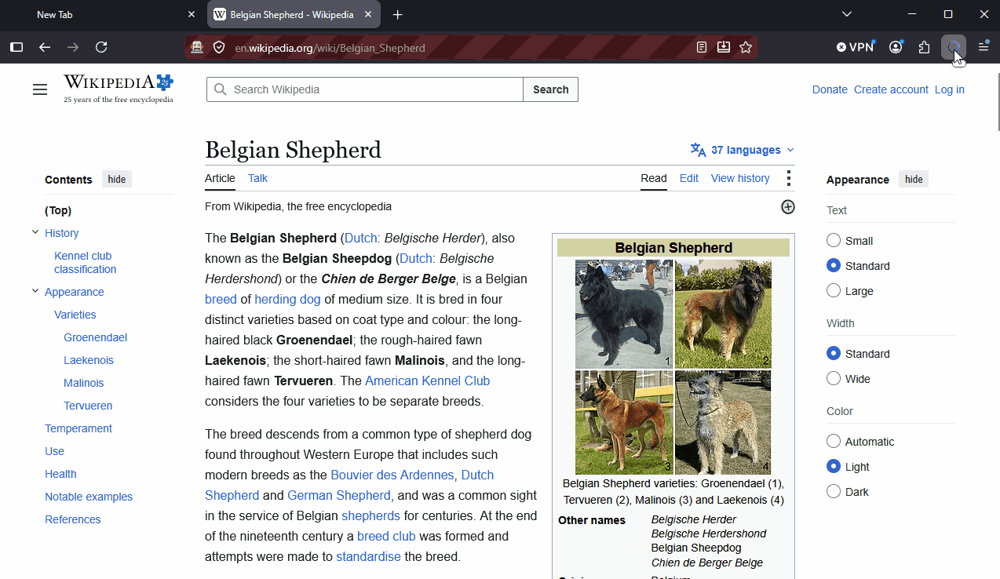
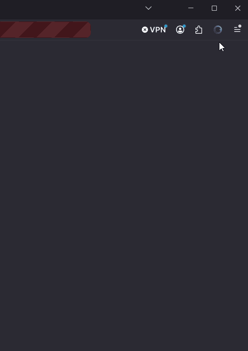
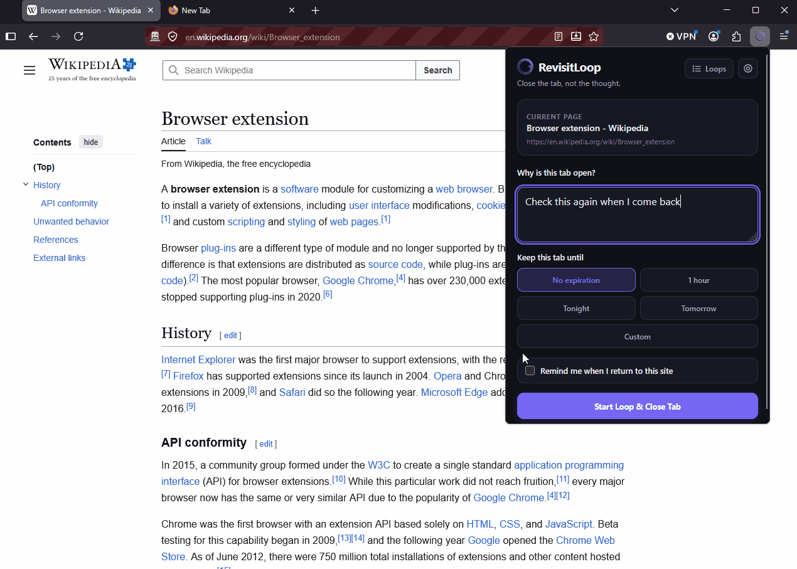
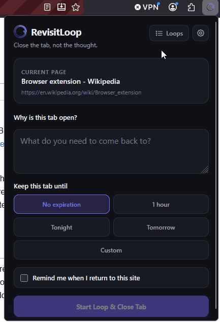
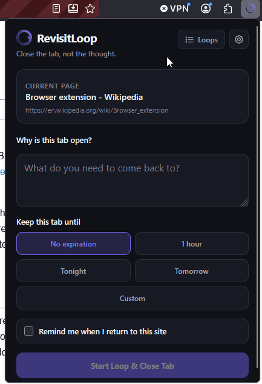
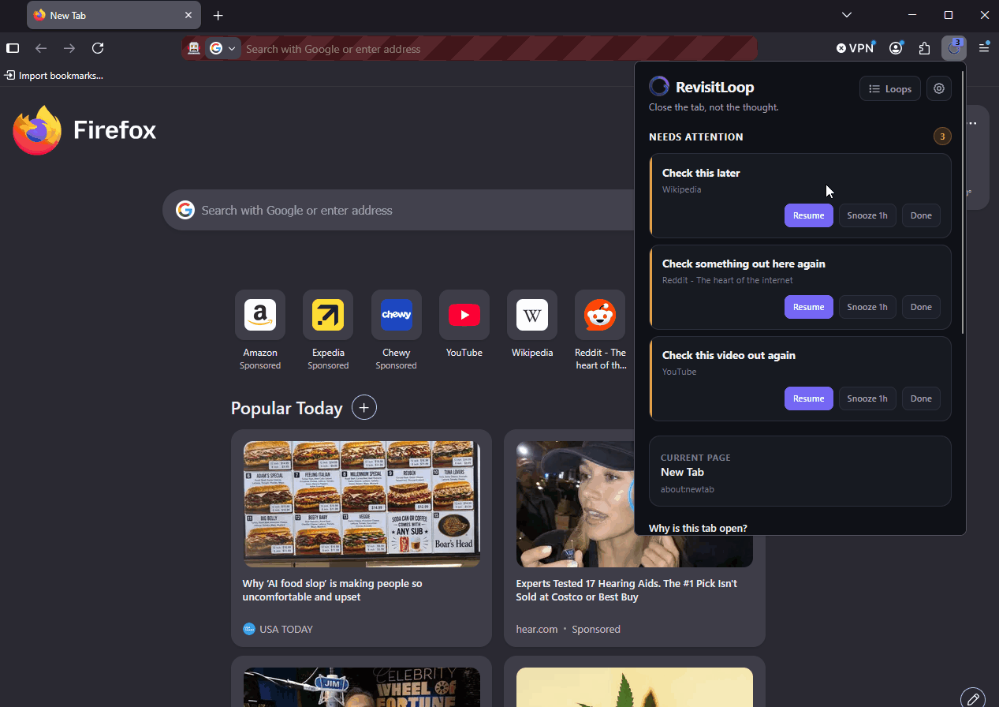
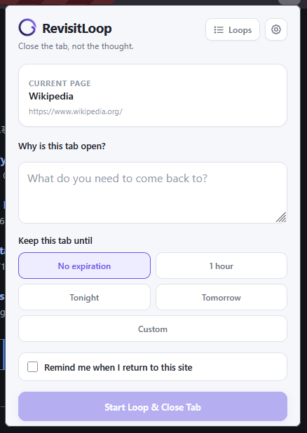
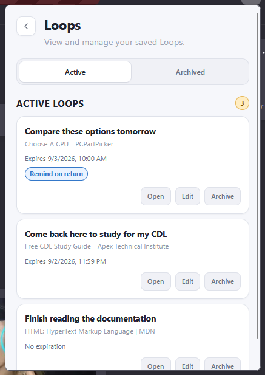
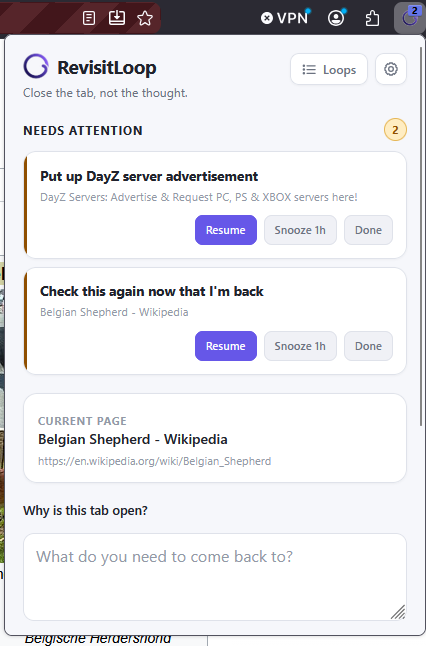
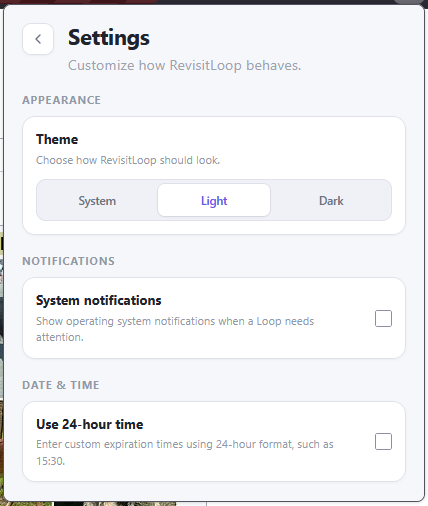

<div align="center">


### Close the tab, not the thought.

**Early Beta · Actively Developed**

RevisitLoop is a local-first browser extension that lets you save why a page matters, close the tab, and come back to it when it actually makes sense.

<br>

**Early Beta** · **Local-first** · **Manifest V3** · **Firefox + Chrome** · **React + TypeScript + WXT**

<br>

[What it does](#what-is-revisitloop) ·
[How it works](#how-revisitloop-works) ·
[Interface](#the-interface) ·
[Privacy](#privacy) ·
[Installation](#installation) ·
[Development](#development)

</div>

---

## What is RevisitLoop?

I tend to leave tabs open because I know I want to come back to them, but a bookmark usually doesn't tell me why I cared about the page in the first place.

RevisitLoop is my attempt to solve that.

Instead of keeping the tab open, you can write down why the page matters, optionally give it a time to come back to your attention, and then close it. RevisitLoop keeps that context stored locally in your browser until you need it again.

You can also have a Loop come back when you return to the same site, which is useful for things that make more sense in context than at a specific time.

### The basic idea

| Step | What happens |
| --- | --- |
| **1** | Open a page you want to come back to. |
| **2** | Write down why it matters. |
| **3** | Choose a lease if you want one. |
| **4** | Start the Loop. |
| **5** | RevisitLoop saves it and closes the tab. |

<p align="center">
  
</p>

---

## How RevisitLoop works

RevisitLoop gives you a few different ways to bring something back to your attention without keeping the original tab open.

### Let a Loop expire

You can give a Loop a lease for one hour, tonight, tomorrow, or a custom date and time.

When the lease expires, RevisitLoop moves it into **Needs Attention** and updates the toolbar badge.

<p align="center">
  
</p>

### Come back when you return to a site

Some things don't need a specific reminder time. They just matter the next time you're working on the same site.

Turn on **Remind me when I return to this site**, close the tab, and RevisitLoop will bring the Loop back to your attention when you visit that hostname again.

<p align="center">
  
</p>

---

## Managing Loops

Once a Loop is saved, you can manage it without having to recreate it.

### Archive and restore

Active Loops can be archived when you don't need them in your main list anymore. Archived Loops can still be opened, restored, or deleted later.

<p align="center">
  
</p>

### Edit a Loop

You can update the purpose, change the lease, or turn return-to-site reminders on or off for an Active Loop.

<p align="center">
  
</p>

### When a Loop needs attention

Waiting Loops give you three options:

| Action | What it does |
| --- | --- |
| **Resume** | Opens the saved page and returns the Loop to Active. |
| **Snooze 1h** | Gives it another hour before it needs attention again. |
| **Done** | Archives the Loop. |

<p align="center">
  
</p>

---

## The interface

RevisitLoop is intentionally kept small and focused. Most of what you need is available directly from the popup without opening a separate dashboard.

<br>

<h3 align="center">Main popup</h3>

<p align="center">
  This is where you create a new Loop from the page you're currently viewing.
</p>

<p align="center">
  
</p>

<br>

<h3 align="center">Active Loops</h3>

<p align="center">
  The Loops view gives you one place to manage what you're still working with and what you've already archived.
</p>

<p align="center">
  
</p>

<br>

<h3 align="center">Needs Attention</h3>

<p align="center">
  When a lease expires or a return-to-site reminder is triggered, the Loop moves into Needs Attention so you can decide what to do with it next.
</p>

<p align="center">
  
</p>

<br>

<h3 align="center">Settings</h3>

<p align="center">
  RevisitLoop keeps its settings simple: theme preference, optional system notifications, and 12-hour or 24-hour time.
</p>

<p align="center">
  
</p>

<p align="center">
  Toolbar badges work independently from system notifications, so you can still see when something needs your attention without enabling OS notifications.
</p>

---

## Privacy

> RevisitLoop is local-first.

Your Loops and settings are stored in your browser using extension storage. RevisitLoop does not currently use a backend, account system, cloud database, or analytics service.

The extension stores things like:

- the page title and URL;
- the reason you saved the page;
- the selected lease and expiration time;
- whether return-to-site reminders are enabled;
- the current Loop status;
- your RevisitLoop settings.

That information stays in the browser unless you remove the extension or clear its stored extension data.

### Permissions

RevisitLoop tries to keep its permissions limited to what the extension actually needs.

| Permission | Why RevisitLoop uses it |
| --- | --- |
| `activeTab` | Reads information about the page you're currently working with when creating a Loop. |
| `tabs` | Opens, closes, and checks browser tabs for Loop behavior and return-to-site reminders. |
| `storage` | Saves Loops and settings locally in the browser. |
| `alarms` | Handles lease expiration without requiring the popup to stay open. |
| `notifications` | Shows optional system notifications when enabled in Settings. |

RevisitLoop does not request access to every website through a broad `<all_urls>` permission, and it does not inject a content script into every page.

System notifications are optional and are turned off by default.

---

## Browser support

RevisitLoop is being developed with Firefox as the primary browser target, with Chromium support being built alongside it.

| Browser | Status |
| --- | --- |
| **Firefox** | Primary development and testing target |
| **Google Chrome** | Core workflows and production build manually tested |
| **Other Firefox-based browsers** | May work, but not every browser has been tested |
| **Other Chromium-based browsers** | Expected to work, but broader browser-specific testing is still ongoing |

The extension uses **Manifest V3** for both Firefox and Chromium builds.

Chrome testing currently includes:

- creating and closing Loops;
- timed lease expiration;
- toolbar badges;
- return-to-site reminders;
- Resume, Snooze, and Done actions;
- editing, archiving, restoring, and deleting Loops;
- Light, Dark, and System themes;
- 12-hour and 24-hour time;
- optional system notifications;
- first-run onboarding;
- production-build installation.

---

## Installation

RevisitLoop is currently in Early Beta and is being prepared for its first public browser-store release.

If you want to try it from source, clone the repository:

```bash
git clone https://github.com/Burn1ngL1ght/revisitloop.git
cd revisitloop
```

Install the dependencies:

```bash
pnpm install
```

Then start the Firefox development build:

```bash
pnpm dev:firefox
```

Or start the Chromium development build:

```bash
pnpm dev:chrome
```

WXT handles building the development version of the extension for the selected browser.

---

## Development

RevisitLoop is currently built with:

| Tool | Role |
| --- | --- |
| **React** | Popup and onboarding UI |
| **TypeScript** | Application code and types |
| **WXT** | Browser-extension framework and build system |
| **WebExtensions / Manifest V3** | Browser extension APIs and manifest format |
| **pnpm** | Package management and scripts |

The project is currently being developed with **Node.js 24** and **pnpm 11**.

### Useful commands

```bash
# Type-check the project
pnpm compile

# Firefox development
pnpm dev:firefox

# Chromium development
pnpm dev:chrome

# Firefox production build
pnpm build:firefox

# Chromium production build
pnpm build:chrome

# Create Firefox distribution ZIP
pnpm zip:firefox

# Create Chromium distribution ZIP
pnpm zip:chrome
```

Production builds are written to the `.output` directory.

---

## Project structure

```text
revisitloop/
├── entrypoints/
│   ├── onboarding/
│   │   ├── index.html
│   │   ├── main.tsx
│   │   ├── Onboarding.tsx
│   │   └── style.css
│   ├── popup/
│   │   ├── components/
│   │   ├── App.tsx
│   │   ├── App.css
│   │   ├── main.tsx
│   │   └── style.css
│   └── background.ts
│
├── public/
│   ├── brand/
│   └── icon/
│
├── services/
├── storage/
├── types/
├── utils/
│
├── docs/
│   └── media/
│
├── package.json
├── tsconfig.json
└── wxt.config.ts
```

<details>
<summary><strong>What each area is for</strong></summary>

### `entrypoints/`

Contains the parts of the extension that WXT turns into browser extension entrypoints.

- `background.ts` handles background events such as lease alarms, badge updates, return-to-site checks, and first-install onboarding.
- `popup/` contains the main RevisitLoop interface.
- `onboarding/` contains the first-run onboarding page.

### `services/`

Contains the logic that connects different parts of RevisitLoop together, including Loop lifecycle actions, lease scheduling, toolbar badges, context reminders, and notifications.

### `storage/`

Contains the local storage definitions and helper functions used to save Loops and RevisitLoop settings.

### `types/`

Contains the TypeScript types used throughout the project, including the Loop and settings models.

### `utils/`

Contains smaller reusable helpers for things such as date and time parsing, lease calculations, themes, and URLs.

### `public/`

Contains files that are copied directly into the built extension, including the RevisitLoop icons and branding.

### `docs/media/`

Contains the screenshots and GIFs used in this README.

</details>

---

## Current status

RevisitLoop is currently in **Early Beta** and is actively being developed.

The core extension is functional and has been manually tested in both Firefox and Google Chrome. RevisitLoop is ready for public use, but this is still an early release, so bugs, browser-specific issues, and changes to features or behavior may still happen as the project develops.

The core workflow currently includes:

- saving the current page as a Loop;
- recording why the page matters;
- closing the original tab after starting the Loop;
- using no expiration, one hour, tonight, tomorrow, or a custom lease;
- moving expired Loops into Needs Attention;
- using toolbar badges for waiting Loops;
- optional system notifications;
- triggering reminders when returning to the same site;
- resuming, snoozing, or finishing waiting Loops;
- editing Active Loops;
- archiving and restoring Loops;
- permanently deleting Archived Loops;
- switching between System, Light, and Dark themes;
- using either 12-hour or 24-hour time;
- completing a first-run onboarding flow.

Firefox remains the primary development target, but Google Chrome has also been manually tested across the core RevisitLoop workflows and production build.

Other Firefox-based and Chromium-based browsers may work, but broader browser-specific testing is still ongoing.

### Early Beta

This release is intended to get RevisitLoop into the hands of real users while development continues.

Feedback, bug reports, and feature suggestions are welcome. Some features may change as the extension is used more and I get a better idea of what actually helps versus what just sounds useful on paper.

---

## Roadmap

Some of the things I want to work on next include:

- more testing across Firefox and Chromium-based browsers;
- additional accessibility testing;
- improving the install and release process;
- browser extension store releases;
- better handling of older stored data as the project changes;
- continued UI and workflow improvements based on actual use;
- automated testing for the core Loop lifecycle;
- better documentation for contributors and development setup.

I want to keep RevisitLoop focused on the original idea rather than turning it into a full tab manager, bookmark manager, or cloud productivity platform.

The main goal is still simple:

<div align="center">

### Save the reason, close the tab, and come back when it matters.

</div>

---

## Contributing

RevisitLoop is still early, but the repository is public because I want the project to be open and learn from building it in the open.

If you find a bug or have an idea that fits the project, feel free to open an issue.

If you want to work on the code, fork the repository, create a branch, and open a pull request with an explanation of what you changed and why.

Before submitting changes, make sure the project still type-checks:

```bash
pnpm compile
```

And, when possible, check both production builds:

```bash
pnpm build:firefox
pnpm build:chrome
```

More detailed contribution guidelines will be added as the project gets further along.

---

## License

RevisitLoop is licensed under the **Mozilla Public License 2.0 (MPL-2.0)**.

You can use, modify, and distribute the project under the terms of the MPL-2.0. If you distribute modified MPL-covered source files, those files must remain available under the MPL-2.0.

See the [LICENSE](LICENSE) file for the full license terms.

## Privacy Policy

RevisitLoop is local-first and does not currently transmit saved Loops or extension data to external servers.

See the full [Privacy Policy](PRIVACY.md) for details.
